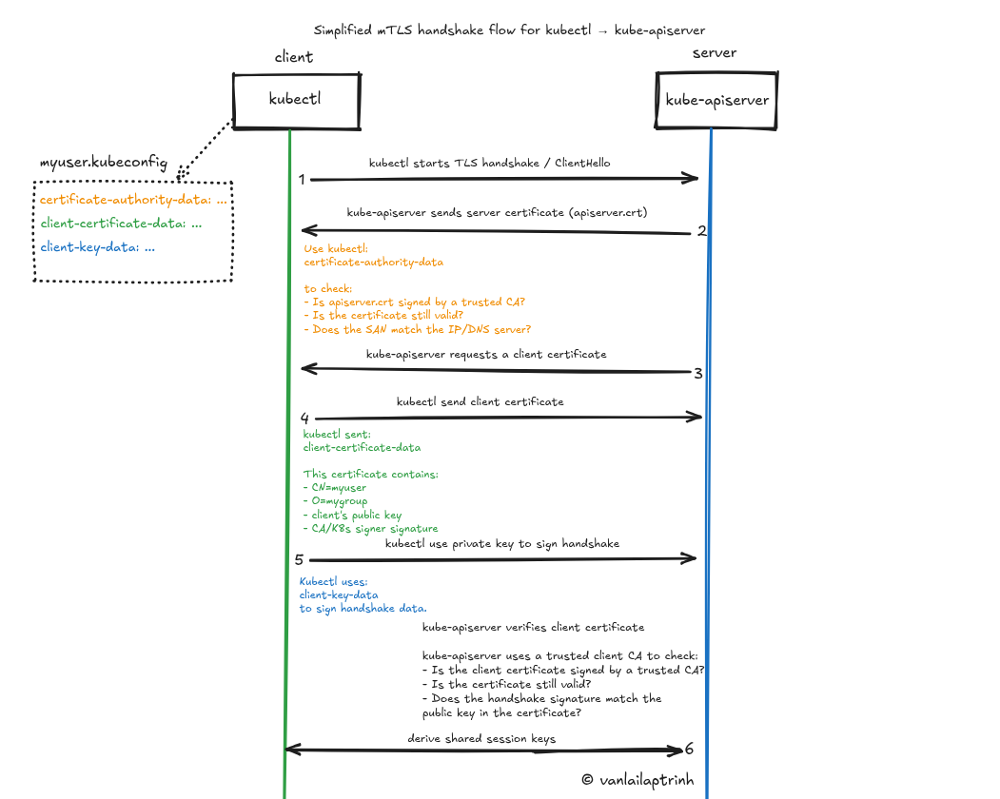

# Kubernetes Authentication via kubeconfig

## 2.4. Initialize the .kubeconfig file

| Field name | What it is? | Role in mTLS |
| :--- | :--- | :--- |
| **certificate-authority-data** | The content of the `ca.crt` file, which is the root certificate of the K8s cluster, encoded in Base64. | Helps you trust K8s. It allows your machine to check whether the API Server is legitimate. |
| **client-certificate-data** | The content of the `van.crt` file, which acts like your employee ID card, encoded in Base64. | Helps K8s trust you. It proves to K8s that “I am van.tran”. |
| **client-key-data** | The content of the `van.key` file, which is your secret key, encoded in Base64. | Proves ownership. It allows K8s to confirm that you are truly the holder of the key associated with the certificate above. |

---

### Visualizing the mTLS Handshake Flow

To understand exactly how and when these three parameters from your `.kubeconfig` file are used during a single `kubectl` command, take a look at the sequence diagram below:

*Figure: Simplified mTLS Handshake Flow between kubectl and kube-apiserver (Designed by @vanlailaptrinh)*